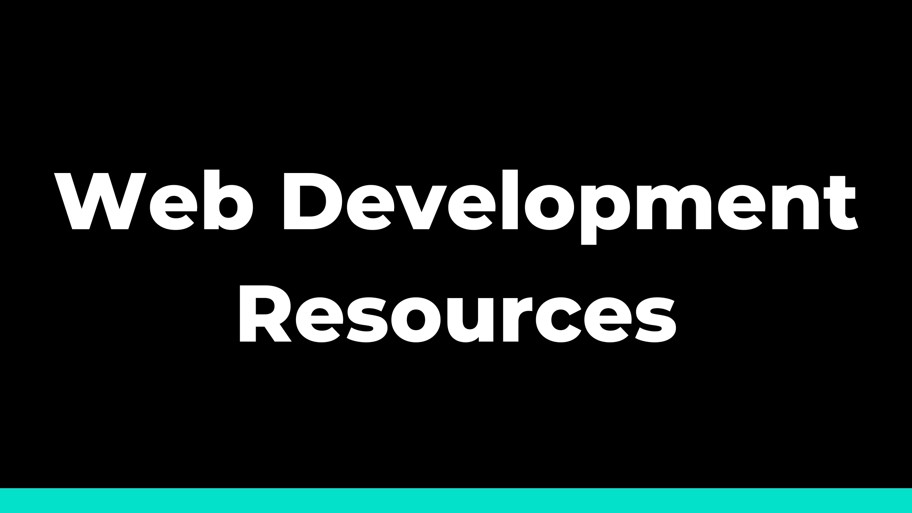

This repository is a compilation of useful Web Development resources.

## Table of Contents: Web Development Resources

-   [UI/UX](#uiux)
-   [Icons](#icons)
-   [Tailwind Frameworks](#tailwind-frameworks)

### UI/UX

-   [**paaatterns**: _Free collection of beautiful patterns for all vector formats._](https://products.ls.graphics/paaatterns/preview.html)
-   [**DrawKit**: _100 vector illustrations and components to build the exact custom scenes, layouts, and illustrations your website or app needs._](https://www.drawkit.com/product/peach-illustration-system)
-   [**unDraw**: _The design project with open-source illustrations for any idea you can imagine and create. Create beautiful websites, products and applications with your color, for free._](https://undraw.co)
-   [**BGJar**: _Free svg background generator for your websites, blogs and app._](https://bgjar.com)
-   [**Blobmaker**: _Make organic SVG shapes for your next design. Modify the complexity, contrast, and color, to generate unique SVG blobs every time._](https://www.blobmaker.app)
-   [**Custom Shape Dividers**: _Create fully responsive shape dividers for your next web project._](https://www.shapedivider.app)

### Icons

-   [**Bootstrap Icons**: _Official open source SVG icon library for Bootstrap_](https://icons.getbootstrap.com)
-   [**Heroicons**: _New MIT open source SVG icon library designed by Steve Schoger. Solid and stroke variants, one-click copy-paste, and Figma file. Built with Tailwind CSS._](https://icons.getbootstrap.com)

### Tailwind Frameworks

-   [**Flowbite**: _Get started with an open-source library of over 450+ UI components, sections, and pages built with the utility classes from Tailwind CSS and designed in Figma._](https://flowbite.com)

-   [**Flowbite React Components**: _Build websites even faster with components on top of React and Tailwind CSS._](https://flowbite-react.com)
